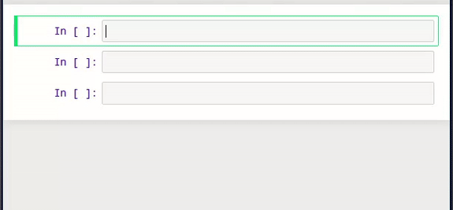

# simple-ismlnj
SML/NJ simple kernel for Jupyter/IPython Notebook

## install

clone this repo to /usr/share/jupyter/kernels/smlnj

or clone it to ~/.local/jupyter/kernels and change kernel.json accordingly

## run (console)

```bash
jupyter console --kernel smlnj
```

## run (notebook)

```bash
jupyter notebook
```

in the browser create an SML/NJ notebook


